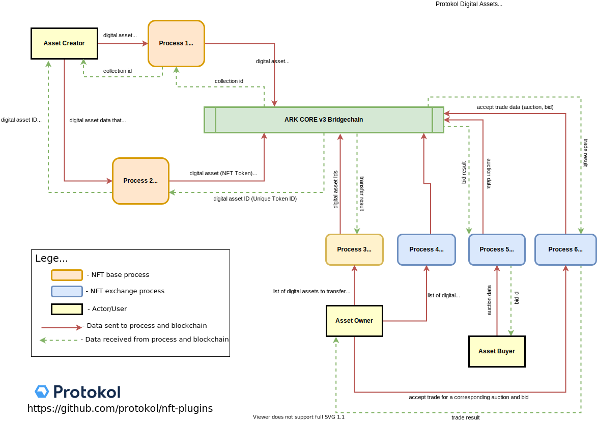

# Introduction To Digital Assets

Digital Assets represent anything that can be saved or tagged on the blockchain supported with a traceable and **unique** identifier. This in practice translates to many use-cases that can be seen in different industries (identity management, supply chain,  digital trading cards and collectibles, loyalty cards and fan tokens, proof of completion/ownership and many more).&#x20;

Non-Fungible Tokens (NFTs) enable new types of collectible digital assets and a new infrastructure for blockchain-based unique items. **Non-Fungible tokens allow anyone to digitalize ownership of any arbitrary data**, while drastically increasing the design space and usability aspects of blockchain solutions \[[1](https://education.district0x.io/general-topics/understanding-ethereum/erc-721-tokens/)]. The biggest differentiator of Non-Fungible tokens versus "regular" tokens is that each one is tied to a different identifier, **making each token unique to its owner**.\
\
To support different industries and their use-cases we have developed a set of NFT-Core plugins and applications that enable us to quickly adapt and scale in related industry verticals.&#x20;

.png>)


All of the mentioned functionalities and content is licensed under [Creative Commons Attribution-NonCommercial-ShareAlike 4.0 International License](https://creativecommons.org/licenses/by-nc-sa/4.0/).


### Why Use Blockchain Together With Digital Asset (NFTs) Management?&#x20;

* Digital Assets (NFTs) enable the creation of rare & unique items that can’t be destroyed, replicated or forged&#x20;
* NFTs can be tracked on the blockchain, providing an immutable history of the assets&#x20;
* NFTs cannot deteriorate over time. So when utilized in applications such as digital collectibles they do not deteriorate like their physical counterpart
* Peer-to-peer, secure trading enabled by blockchain technology&#x20;
* NFTs can be sold, and traded / exchanged back into Fiat

## Overview Of Digital Asset Management Process&#x20;

We developed a set of ARK Core plugins and SKDs that fully support Digital Asset management process,  from the creation and ownership to the interaction and trading part of digital assets. The diagram below shows the actors and top-level processes associated with Digital Asset management functionalities.

## Next Steps

Learn how to create and trade digital assets here:


[crypto-examples.md](tutorials/crypto-examples.md)



[how-to-trade-digital-assets.md](tutorials/how-to-trade-digital-assets.md)


