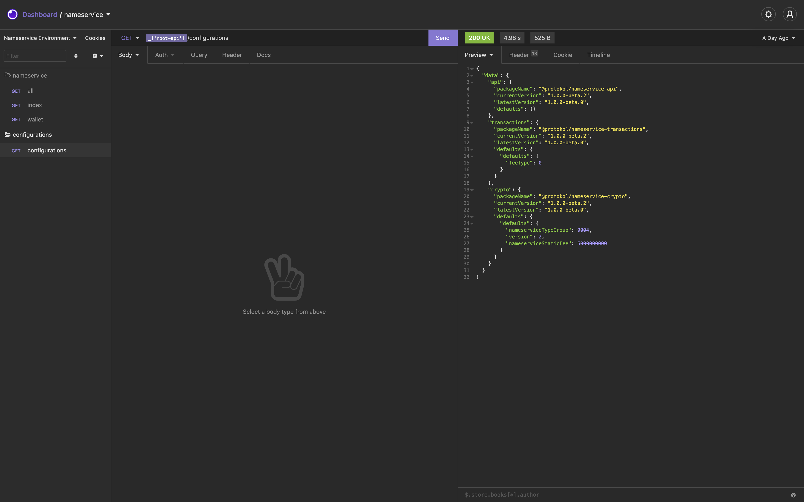

# Development

### Prerequisites

* **Node version 12.x or 14.x**
* **yarn package manager**
* **docker and docker-compose**


For more information about setting up development environment go to   
[https://ark.dev/docs/core/getting-started/development-setup/introduction](https://ark.dev/docs/core/getting-started/development-setup/introduction)


### To run local development enviornment execute the following steps:

#### 1. Clone nameservie reposiory

```bash
git clone https://github.com/protokol/nameservice.git

cd nameservice
```

#### 2. Run Postgres database

```bash
cd docker/development/testnet

docker-compose up postgres
```

#### 3. Run local blockchain

_**From repository root folder:**_

```bash
yarn full:testnet
```

### Version Bumping

#### Prerelease

```bash
yarn version:beta
```

#### Patch

```bash
yarn version:patch
```

### Changelog

```bash
yarn changelog
```

### Insomnia


Import insomnia file from `nameservice/insomnia`





